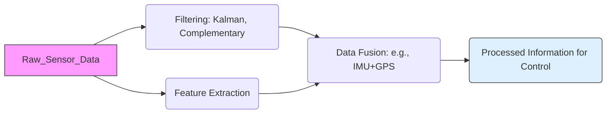

### Chapter 03: Sensors & Actuators

#### Learning Objectives
After studying this chapter, you should be able to:
*   Categorize and describe the operating principles of various proprioceptive and exteroceptive sensors used in robotics, including IMUs, LiDAR, and cameras.
*   Explain fundamental concepts of signal conditioning, filtering, and data fusion for raw sensor data.
*   Analyze the characteristics and applications of different types of actuators, such as electric motors (DC, servo, stepper), hydraulic, and pneumatic systems.
*   Understand the critical role of real-time sensor feedback and actuator control in closed-loop robotic systems.
*   Implement practical examples of sensor data acquisition and actuator command generation using Python and ROS2.

#### Theory Explanation

**3.1 Introduction to Robot Perception and Action**

Robots, as physical AI systems, engage with the world through a continuous cycle of **perception** and **action**. **Sensors** enable perception by gathering information about the robot's internal state and its external environment. **Actuators** enable action by converting control signals into physical motion or force. The effective, real-time integration of these components with robust control systems is fundamental to achieving autonomous and intelligent robotic behavior.

**3.2 Robotic Sensors: The Eyes and Ears of a Robot**

Robotic sensors can be broadly classified based on what they measure:

**3.2.1 Proprioceptive Sensors**
These sensors provide information about the robot's *internal state*, such as its joint positions, velocities, and forces. They are crucial for precise control and self-awareness.

*   **Encoders**: Measure the angular position or velocity of a motor shaft or joint. Optical encoders are common, using light emitters and detectors to count rotations or determine absolute position. Essential for feedback in joint control loops.
*   **Potentiometers**: Measure linear or angular displacement by varying resistance. Simpler and less precise than encoders, often used for position sensing in less critical applications.
*   **Force/Torque Sensors**: Measure forces and torques exerted at robot joints or end-effectors. Critical for compliant control, grasping delicate objects, and safe physical human-robot interaction.
*   **Inertial Measurement Units (IMUs)**: Typically integrate accelerometers (measure linear acceleration), gyroscopes (measure angular velocity), and sometimes magnetometers (measure magnetic field for heading). Used for estimating robot orientation, velocity, and sometimes position (through integration, prone to drift) – vital for mobile and humanoid balance.

**3.2.2 Exteroceptive Sensors**
These sensors provide information about the robot's *external environment*.

*   **LiDAR (Light Detection and Ranging)**:
    *   **Principle**: Emits pulsed laser light and measures the time it takes for the light to return after hitting an object. This `Time-of-Flight (ToF)` principle allows for precise distance measurement.
    *   **Types**: 2D (rotating head for a plane scan) and 3D (multiple lasers or rotating mirrors for a point cloud).
    *   **Applications**: Mapping, localization, navigation, obstacle detection and avoidance (SLAM, discussed in Chapter 7).
*   **Cameras (Visual Sensors)**:
    *   **Principle**: Capture light to form images. Different types provide different information.
    *   **Monocular Cameras**: Standard 2D images. Used for object detection, recognition, tracking, visual servoing (Chapter 7).
    *   **Stereo Cameras**: Two cameras spaced apart, mimicking human binocular vision. Allows for passive depth estimation by triangulation, creating 3D point clouds.
    *   **Depth Cameras (e.g., RGB-D, ToF cameras like Intel RealSense, Microsoft Kinect)**: Directly provide depth information per pixel, usually via structured light patterns or Time-of-Flight measurements. Excellent for 3D perception, manipulation, and human pose estimation.
    *   **Applications**: Object manipulation, facial recognition, visual SLAM, human-robot interaction, scene understanding.
*   **Proximity/Range Sensors**: Low-cost sensors for short-range obstacle detection.
    *   **Ultrasonic Sensors**: Emit sound waves and measure the time for the echo to return. Effective for detecting large objects, but susceptible to specular reflections and beam divergence.
    *   **Infrared (IR) Sensors**: Emit IR light and measure the reflected intensity or time-of-flight. Can be affected by ambient light and surface properties.

**3.3 Signal Processing and Data Fusion**

Raw sensor data is often noisy, incomplete, and comes from different modalities. **Signal Processing** and **Data Fusion** are critical for converting this raw data into reliable information for the robot controller.

*   **Filtering**: Reducing noise from sensor readings. Common filters include:
    *   **Moving Average Filter**: Simple low-pass filter to smooth out high-frequency noise.
    *   **Kalman Filter**: An optimal recursive data processing algorithm that estimates the state of a dynamic system from a series of incomplete and noisy measurements. Widely used for state estimation (position, velocity, orientation) by fusing data from IMUs, GPS, and odometry.
    *   **Complementary Filter**: Combines high-pass and low-pass filters to fuse data from sensors like accelerometers (good for slow changes) and gyroscopes (good for fast changes) to provide a stable orientation estimate.
*   **Data Fusion**: Combining information from multiple sensors to achieve a more robust, accurate, or complete understanding of the robot's state or environment than any single sensor could provide. For instance, fusing LiDAR data for accurate mapping with IMU data for robust localization.
*   **Feature Extraction**: Deriving meaningful features from raw sensor data (e.g., edges from camera images, planar surfaces from LiDAR point clouds, peaks from force sensor data).

**3.4 Robotic Actuators: Bringing Robots to Life**

Actuators are the muscles of a robot, converting electrical, hydraulic, or pneumatic energy into mechanical motion.

**3.4.1 Electric Motors**
Most common in modern robotics, offering precise control, high efficiency, and clean operation.

*   **DC Motors**: Simple, inexpensive, provide continuous rotation. Speed is proportional to voltage. Often used with gearboxes to increase torque and reduce speed.
*   **Servo Motors**: A DC motor coupled with an encoder, gearbox, and a control circuit. Designed for precise angular position control. Widely used in RC applications and smaller robot joints.
*   **Stepper Motors**: Rotate in discrete steps. Provide good open-loop position control (no feedback sensor needed for basic operation) and high holding torque. Common in applications requiring precise, repeatable positioning without continuous feedback.
*   **Brushless DC (BLDC) Motors**: Offer higher efficiency, better power-to-weight ratio, and longer lifespan than brushed DC motors. Require more complex electronic commutation.

**3.4.2 Hydraulic Actuators**
*   **Principle**: Use incompressible fluid (oil) under pressure to generate linear or rotary motion.
*   **Characteristics**: Provide very high force and power density, stiffness, and speed. Inherently safe against overloads.
*   **Applications**: Heavy-duty industrial robots, construction machinery, highly dynamic humanoids (e.g., Boston Dynamics Atlas) where extreme forces are needed.
*   **Drawbacks**: Require complex hydraulic power units, can be messy (leaks), and noisy.

**3.4.3 Pneumatic Actuators**
*   **Principle**: Use compressible fluid (air) under pressure.
*   **Characteristics**: Simpler, cleaner, and faster than hydraulics for some tasks. Lower force density than hydraulics.
*   **Applications**: Grippers, simple pick-and-place tasks, applications where compliance is desired (e.g., soft robotics).
*   **Drawbacks**: Less precise control due to air compressibility, lower stiffness.

**3.4.4 Emerging Actuators**
*   **Soft Actuators**: Made from compliant materials, designed for safe and adaptive interaction with unstructured environments and humans (e.g., pneumatic artificial muscles, electroactive polymers).
*   **Series Elastic Actuators (SEAs)**: Integrate a spring element in series with a motor. Improves force control, robustness to impacts, and provides passive compliance, crucial for safe HRI.

**3.5 Real-time Feedback in Closed-Loop Control**

The synergy between sensors and actuators is epitomized in **closed-loop control systems**, which are fundamental to achieving precise and stable robot behavior. In a closed-loop system:

1.  **Desired State (Setpoint)**: A target value for a robot's state (e.g., desired joint angle, end-effector position).
2.  **Sensor Measurement**: Sensors continuously measure the robot's actual state.
3.  **Error Calculation**: The measured state is compared to the desired state to calculate the error.
4.  **Control Signal Generation**: A controller (e.g., PID, as discussed in Chapter 4) generates a command signal based on this error.
5.  **Actuator Action**: Actuators execute the command, driving the robot towards the desired state.
6.  **Feedback**: The new state is measured by sensors, closing the loop.

This continuous feedback allows robots to compensate for disturbances, handle uncertainties, and maintain desired performance dynamically, making them resilient to real-world complexities.

#### Diagrams

```mermaid
graph TD
    subgraph Robot Sensing (Perception)
        P1(Proprioceptive) --> E(Encoders);
        P1 --> F(Force/Torque Sensors);
        P1 --> I(IMUs);

        E1(Exteroceptive) --> L(LiDAR);
        E1 --> C(Cameras: Monocular, Stereo, Depth);
        E1 --> PR(Proximity/Range);
    end

    S(Sensors) --> SP(Signal Processing & Data Fusion);
    SP --> RC(Robot Controller);

    subgraph Robot Actuation (Action)
        A1(Electric Motors) --> DCM(DC Motors);
        A1 --> SM(Servo Motors);
        A1 --> STM(Stepper Motors);
        A1 --> BLM(BLDC Motors);

        A2(Fluid Power) --> HYD(Hydraulic Actuators);
        A2 --> PNE(Pneumatic Actuators);

        A(Actuators) --> RC;
    end

    RC --> A;
    SP -- Feedback --> RC;
    RC -- Commands --> A;
    A -- Affects --> Env(Environment & Robot Body);
    Env -- Provides Input --> S;
```
**Figure 3.1: Comprehensive Sensor-Actuator-Control Architecture**


**Figure 3.2: Sensor Data Processing Pipeline**

#### Python/ROS2 Code Examples

##### 1. Python: Simulated IMU Data Filtering with a Complementary Filter
This example simulates noisy accelerometer and gyroscope data and fuses them using a basic complementary filter to provide a more stable pitch estimate.

```python
import math
import random
import time

class IMUSimulator:
    def __init__(self, initial_pitch_deg=0.0):
        self.true_pitch_rad = math.radians(initial_pitch_deg)
        self.accel_bias = random.uniform(-0.02, 0.02)
        self.gyro_bias = random.uniform(-0.01, 0.01)

    def get_readings(self, dt):
        # Simulate true pitch changing slowly
        self.true_pitch_rad += random.uniform(-0.01, 0.01) * dt * 5 # Small oscillation
        self.true_pitch_rad = max(-math.pi/2, min(math.pi/2, self.true_pitch_rad))

        # Simulate accelerometer reading (noisy, good for orientation in static/slow)
        # ax is proportional to sin(pitch), ay to cos(pitch)
        # Here, simplifying to get pitch from accelerometer assuming no linear acceleration
        accel_pitch = math.atan2(0, -9.81 * math.sin(self.true_pitch_rad)) # Ideal
        accel_pitch_noisy = accel_pitch + random.uniform(-0.1, 0.1) + self.accel_bias

        # Simulate gyroscope reading (noisy, good for rate of change)
        gyro_rate_noisy = (random.uniform(-0.05, 0.05) + self.gyro_bias) # Noisy angular rate

        return accel_pitch_noisy, gyro_rate_noisy

class ComplementaryFilter:
    def __init__(self, alpha, initial_pitch_rad=0.0):
        self.alpha = alpha  # Weight for accelerometer (0 < alpha < 1)
        self.filtered_pitch_rad = initial_pitch_rad

    def update(self, accel_pitch_rad, gyro_rate_rad_s, dt):
        # Integrate gyro rate to get angular position change
        gyro_pitch_estimate = self.filtered_pitch_rad + gyro_rate_rad_s * dt

        # Fuse accelerometer and gyroscope estimates
        self.filtered_pitch_rad = self.alpha * accel_pitch_rad + (1 - self.alpha) * gyro_pitch_estimate
        return self.filtered_pitch_rad

if __name__ == "__main__":
    initial_pitch_deg = 10.0
    imu_sim = IMUSimulator(initial_pitch_deg=initial_pitch_deg)
    # Alpha closer to 1 means more trust in accelerometer (good for slow)
    # Alpha closer to 0 means more trust in gyro (good for fast, but prone to drift)
    comp_filter = ComplementaryFilter(alpha=0.98, initial_pitch_rad=math.radians(initial_pitch_deg))

    dt = 0.01 # 100 Hz update rate
    duration = 5 # seconds

    print(f"Simulating IMU and Complementary Filter for {duration} seconds...")
    for i in range(int(duration / dt)):
        accel_pitch, gyro_rate = imu_sim.get_readings(dt)
        filtered_pitch = comp_filter.update(accel_pitch, gyro_rate, dt)

        # For display, convert to degrees
        true_pitch_deg = math.degrees(imu_sim.true_pitch_rad)
        accel_pitch_deg = math.degrees(accel_pitch)
        filtered_pitch_deg = math.degrees(filtered_pitch)

        if i % 50 == 0: # Print every 0.5 seconds
            print(f"Time: {i*dt:.2f}s | True Pitch: {true_pitch_deg:.2f}° | Accel Est: {accel_pitch_deg:.2f}° | Filtered Pitch: {filtered_pitch_deg:.2f}°")
        time.sleep(dt)
    print("Simulation finished.")
```

##### 2. ROS2: Publisher/Subscriber for Actuator Command and Status (Python)
This example demonstrates a basic ROS2 node that acts as a simple motor controller. It subscribes to a desired velocity command and publishes its current (simulated) velocity, reflecting the closed-loop idea.

```python
# motor_controller_node.py

import rclpy
from rclpy.node import Node
from std_msgs.msg import Float32 # For velocity commands and status

class MotorControllerNode(Node):
    def __init__(self):
        super().__init__('motor_controller_node')
        self.cmd_vel_sub = self.create_subscription(
            Float32, 'motor/cmd_velocity', self.velocity_command_callback, 10)
        self.current_vel_pub = self.create_publisher(
            Float32, 'motor/current_velocity', 10)

        self.desired_velocity = 0.0
        self.actual_velocity = 0.0
        self.max_acceleration = 0.1 # Simulate motor dynamics

        self.control_timer = self.create_timer(0.05, self.update_motor_state) # 20 Hz

        self.get_logger().info('MotorControllerNode started.')

    def velocity_command_callback(self, msg: Float32):
        self.desired_velocity = msg.data
        self.get_logger().info(f'Received desired velocity: {self.desired_velocity:.2f}')

    def update_motor_state(self):
        # Simulate motor accelerating/decelerating towards desired velocity
        error = self.desired_velocity - self.actual_velocity

        # Limit acceleration
        acceleration_step = self.max_acceleration * 0.05 # dt of 0.05s
        if error > acceleration_step:
            self.actual_velocity += acceleration_step
        elif error < -acceleration_step:
            self.actual_velocity -= acceleration_step
        else:
            self.actual_velocity = self.desired_velocity # Reached desired speed

        # Clamp velocity to a realistic range (e.g., -1.0 to 1.0)
        self.actual_velocity = max(-1.0, min(1.0, self.actual_velocity))

        current_vel_msg = Float32()
        current_vel_msg.data = self.actual_velocity
        self.current_vel_pub.publish(current_vel_msg)
        # self.get_logger().info(f'Actual velocity: {self.actual_velocity:.2f}')

def main(args=None):
    rclpy.init(args=args)
    node = MotorControllerNode()
    rclpy.spin(node)
    node.destroy_node()
    rclpy.shutdown()

if __name__ == '__main__':
    main()
```
To test this ROS2 node:
1.  Save `motor_controller_node.py` in a ROS2 package and add an entry point in `setup.py`.
2.  Build and source the workspace.
3.  Run: `ros2 run <your_pkg> motor_controller_node`
4.  In another terminal, send velocity commands: `ros2 topic pub --once /motor/cmd_velocity std_msgs/msg/Float32 "{data: 0.8}"`
5.  Monitor published actual velocity: `ros2 topic echo /motor/current_velocity`

#### Exercises + MCQs

##### Exercises
1.  **Sensor Modalities**: Compare and contrast the strengths and weaknesses of LiDAR versus a stereo camera for 3D environment perception in an autonomous mobile robot. Discuss scenarios where each would be preferred or where their fusion would be most beneficial.
2.  **Actuator Selection & Sizing**: You need to select an actuator for a humanoid robot's hand to grip objects ranging from delicate to moderately firm. Discuss the trade-offs between electric servo motors and pneumatic artificial muscles for this application, considering precision, force, compliance, and energy efficiency.
3.  **Data Fusion Design**: Propose a data fusion strategy (e.g., using a Kalman or Complementary Filter) for a humanoid robot to estimate its center of mass (CoM) position and velocity, given inputs from an IMU (on its torso) and joint encoders (on its legs). Explain why fusing these specific sensor types is advantageous.
4.  **ROS2 Custom Message**: Design a custom ROS2 message for a `MotorStatus` that includes `motor_id` (int), `current_rpm` (float), `current_temperature` (float), and `fault_code` (int). Explain how this message would be used by a `MotorDiagnosticNode` that subscribes to it.

##### Multiple Choice Questions

:::info
Which of the following sensors is an *exteroceptive* sensor?
- [ ] Encoder
- [ ] Potentiometer
- [x] LiDAR
- [ ] Joint force sensor
:::

:::info
What is the primary benefit of using a **Kalman Filter** in robotic sensor processing?
- [ ] To simplify the mechanical design of the robot.
- [ ] To replace the need for physical sensors.
- [x] To optimally estimate the state of a system by fusing noisy and incomplete measurements over time.
- [ ] To increase the robot's aesthetic appeal.
:::

:::info
Hydraulic actuators are typically preferred in robotics applications requiring:
- [ ] Very low power consumption.
- [ ] High precision open-loop position control.
- [x] Very high force and power density.
- [ ] Extremely silent operation.
:::

:::info
The continuous comparison of a robot's actual state with its desired state, and subsequent adjustment of commands, describes which fundamental control principle?
- [ ] Open-loop control
- [ ] Feedforward control
- [x] Closed-loop feedback control
- [ ] Manual teleoperation
:::

:::info
Which ROS2 message type would be most appropriate for a node publishing instantaneous motor current readings (a single float value) at a high frequency?
- [ ] `sensor_msgs/msg/JointState`
- [x] `std_msgs/msg/Float32`
- [ ] `geometry_msgs/msg/Pose`
- [ ] `std_srvs/srv/Trigger`
:::
