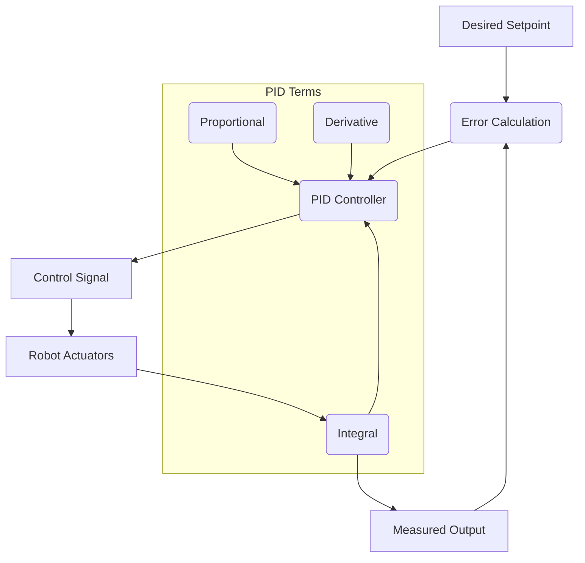

### Chapter 04: Control Systems

#### Learning Objectives
After studying this chapter, you should be able to:
*   Explain the fundamental concepts of feedback control systems.
*   Implement and tune Proportional-Integral-Derivative (PID) controllers.
*   Understand the differences between kinematic and dynamic control.
*   Describe advanced control strategies like adaptive and robust control.
*   Develop basic control loops for robot joints using Python/ROS2.

#### Theory Explanation

**Control Systems** are essential for enabling robots to perform desired actions accurately and stably. The core idea is to regulate a system's behavior by continuously comparing its actual output to a desired setpoint and adjusting inputs to minimize the error.

**Feedback Control** is the most common paradigm in robotics. It involves measuring the current state of the system (using sensors), comparing it to the desired state, and using the error to calculate corrective control signals. This closed-loop approach allows the robot to compensate for disturbances and uncertainties in the environment.

**Proportional-Integral-Derivative (PID) Controllers** are ubiquitous in industrial control due to their simplicity and effectiveness. A PID controller calculates an error value as the difference between a desired setpoint and a measured process variable. It then applies a correction based on three terms:
*   **Proportional (P)**: Corrects error proportional to its current value. Provides a quick response but can lead to oscillations and steady-state error.
*   **Integral (I)**: Corrects for accumulated past errors, eliminating steady-state error but potentially increasing overshoot and instability.
*   **Derivative (D)**: Responds to the rate of change of the error, providing damping and reducing overshoot, but can amplify noise.

**Kinematic Control** focuses on controlling the robot's position and velocity in space (task space) without explicitly considering its mass, inertia, or external forces. It relies on the kinematic model (covered in Chapter 2) and is suitable for slower movements or when dynamic effects are negligible.

**Dynamic Control**, in contrast, explicitly considers the robot's mass, inertia, gravity, and other forces/torques. It aims to control the robot's acceleration or joint torques directly, enabling faster, more precise, and force-aware movements. Model-based dynamic control often uses inverse dynamics to calculate the joint torques required to achieve desired accelerations.

**Advanced Control Strategies** include:
*   **Adaptive Control**: Modifies controller parameters online to account for uncertainties or changes in robot dynamics or environment.
*   **Robust Control**: Designs controllers that maintain desired performance despite significant uncertainties or disturbances.
*   **Impedance Control**: Controls the mechanical impedance (relationship between force and velocity) of the robot at the end-effector, allowing for compliant interaction with the environment.

**Control of Humanoid Joints** is particularly challenging due to high degrees of freedom, complex coupled dynamics, and the need for balance and stability. Techniques often combine hierarchical control (high-level task planning, mid-level whole-body control, low-level joint control) with specialized algorithms for balance, gait generation, and contact management.

#### Diagrams


**Figure 4.1: General Feedback Control Loop with PID Controller**

#### Python/ROS2 Code Examples

##### Python: Basic PID Controller Implementation
This example shows a simple Python implementation of a PID controller, often used in simulated or simplified control tasks.

```python
import time

class PIDController:
    def __init__(self, kp, ki, kd, setpoint):
        self.kp = kp
        self.ki = ki
        self.kd = kd
        self.setpoint = setpoint
        self.prev_error = 0
        self.integral = 0

    def update(self, current_value, dt):
        error = self.setpoint - current_value
        self.integral += error * dt
        derivative = (error - self.prev_error) / dt
        output = self.kp * error + self.ki * self.integral + self.kd * derivative
        self.prev_error = error
        return output

class SimulatedMotor:
    def __init__(self, initial_position=0.0):
        self.position = initial_position
        self.velocity = 0.0
        self.max_velocity = 1.0

    def move(self, control_signal, dt):
        # Simulate simple motor physics
        # Control signal is interpreted as desired acceleration or force
        self.velocity += control_signal * dt * 0.1 # Simplified acceleration effect
        self.velocity = max(-self.max_velocity, min(self.max_velocity, self.velocity))
        self.position += self.velocity * dt
        return self.position

if __name__ == "__main__":
    # Target position for the motor
    target_position = 10.0

    # PID gains (these would need tuning for a real system)
    kp = 0.5
    ki = 0.1
    kd = 0.05

    pid = PIDController(kp, ki, kd, target_position)
    motor = SimulatedMotor(initial_position=0.0)

    dt = 0.1 # simulation time step
    print(f"Target Position: {target_position:.2f}")

    for i in range(100):
        current_position = motor.position
        control_output = pid.update(current_position, dt)
        new_position = motor.move(control_output, dt)

        print(f"Time: {i*dt:.1f}s, Current Position: {new_position:.2f}, Control Output: {control_output:.2f}")

        if abs(target_position - new_position) < 0.05: # Close enough to target
            print("Target reached!")
            break
        time.sleep(0.01)
```

##### ROS2: Conceptual Joint Position Controller (Pseudocode)
In ROS2, PID controllers are often implemented as part of a `ros2_control` hardware interface or a dedicated controller. Here's a conceptual node that would use PID to control a single joint's position, subscribing to a desired position and publishing motor commands.

```python
# pseudo_joint_controller_node.py

import rclpy
from rclpy.node import Node
from std_msgs.msg import Float64 # For desired position and motor command
from sensor_msgs.msg import JointState # For actual joint position feedback

class PseudoJointControllerNode(Node):
    def __init__(self):
        super().__init__('pseudo_joint_controller')
        self.declare_parameter('joint_name', 'joint1')
        self.joint_name = self.get_parameter('joint_name').get_parameter_value().string_value

        # PID gains (would be loaded from parameter server in real ROS2 app)
        self.kp = 10.0
        self.ki = 1.0
        self.kd = 0.5
        self.setpoint = 0.0
        self.prev_error = 0.0
        self.integral = 0.0
        self.last_time = self.get_clock().now()

        self.desired_pos_sub = self.create_subscription(
            Float64, f'/joint_command/{self.joint_name}/position', self.setpoint_callback, 10)
        self.joint_state_sub = self.create_subscription(
            JointState, '/joint_states', self.joint_state_callback, 10)
        self.motor_pub = self.create_publisher(
            Float64, f'/motor_command/{self.joint_name}/effort', 10) # Or velocity/position

        self.control_timer = self.create_timer(0.01, self.control_loop) # 100 Hz control loop

        self.get_logger().info(f'PseudoJointController for {self.joint_name} started.')

    def setpoint_callback(self, msg):
        self.setpoint = msg.data
        self.get_logger().info(f'Setpoint for {self.joint_name} updated to: {self.setpoint:.2f}')

    def joint_state_callback(self, msg):
        # Find the position of our specific joint
        try:
            idx = msg.name.index(self.joint_name)
            self.current_position = msg.position[idx]
        except ValueError:
            self.get_logger().warn(f'Joint {self.joint_name} not found in joint_states.')
            self.current_position = None

    def control_loop(self):
        if self.current_position is None: return

        current_time = self.get_clock().now()
        dt = (current_time - self.last_time).nanoseconds / 1e9 # Convert to seconds
        self.last_time = current_time

        error = self.setpoint - self.current_position
        self.integral += error * dt
        derivative = (error - self.prev_error) / dt
        control_output = self.kp * error + self.ki * self.integral + self.kd * derivative
        self.prev_error = error

        motor_command = Float64()
        motor_command.data = control_output
        self.motor_pub.publish(motor_command)
        # self.get_logger().info(f'Control loop: pos={self.current_position:.2f}, error={error:.2f}, cmd={control_output:.2f}')

def main(args=None):
    rclpy.init(args=args)
    node = PseudoJointControllerNode()
    rclpy.spin(node)
    node.destroy_node()
    rclpy.shutdown()

if __name__ == '__main__':
    main()
```

#### Exercises + MCQs

##### Exercises
1.  **PID Tuning**: Explain the likely behavior of a PID controller if:
    a.  `Kp` is too high (and `Ki`, `Kd` are zero).
    b.  `Ki` is too high (and `Kp`, `Kd` are reasonable).
    c.  `Kd` is too high (and `Kp`, `Ki` are reasonable) in a noisy environment.
2.  **Kinematic vs. Dynamic Control**: For a humanoid robot performing a slow, precise pick-and-place task versus a fast, highly dynamic jumping motion, explain why one might prefer kinematic control for the former and dynamic control for the latter.
3.  **ROS2 Control**: Research the `ros2_control` framework. Briefly describe its main components (e.g., hardware interface, controller manager) and how they facilitate robot control in ROS2.

##### Multiple Choice Questions

:::info
What is the primary role of the Integral term (`Ki`) in a PID controller?
- [ ] To provide a quick response to current error.
- [x] To eliminate steady-state error by accumulating past errors.
- [ ] To reduce overshoot by reacting to the rate of error change.
- [ ] To filter sensor noise.
:::

:::info
Which type of robot control explicitly considers the robot's mass, inertia, and external forces?
- [ ] Kinematic Control
- [x] Dynamic Control
- [ ] Open-loop Control
- [ ] Positional Control
:::

:::info
A robot operating within a closed-loop control system:
- [ ] Does not require sensor feedback.
- [ ] Has its actuators directly commanded without correction.
- [x] Continuously adjusts its actions based on sensor feedback comparing actual to desired states.
- [ ] Is immune to environmental disturbances.
:::
