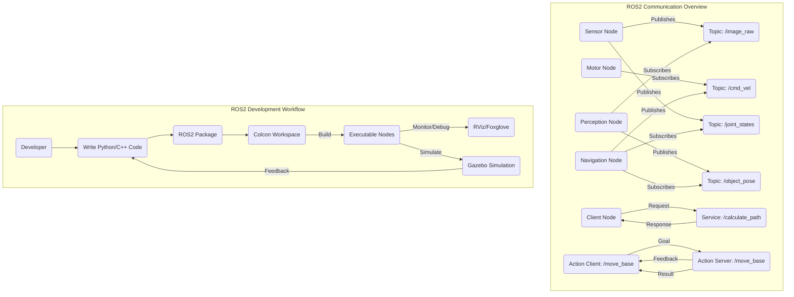

### Chapter 05: Robot Programming in Python & ROS2

#### Learning Objectives
After studying this chapter, you should be able to:
*   Understand the fundamental architecture and core communication concepts of Robot Operating System 2 (ROS2), including Nodes, Topics, Messages, Services, and Actions.
*   Master the creation, building, and management of ROS2 packages and Python nodes using the `rclpy` client library.
*   Implement inter-node communication patterns: asynchronous publisher-subscriber for data streams and synchronous service-client for request-response interactions.
*   Develop basic robot control scripts in Python, leveraging ROS2 APIs for simulated and real robotic platforms.
*   Utilize ROS2 parameter server for dynamic configuration and explore basic debugging tools within the ROS2 ecosystem.

#### Theory Explanation

**5.1 Introduction to ROS2: A Robotics Middleware**

**Robot Operating System 2 (ROS2)** is an open-source middleware suite for robot application development. It is not an operating system, but rather a set of software libraries, tools, and conventions that abstract away the complexities of low-level hardware interaction, inter-process communication, and distributed system management. ROS2 builds upon the success of ROS1, designed with modern distributed systems principles, ensuring better real-time capabilities, security, and multi-robot support.

ROS2 facilitates modular software development, allowing different functionalities (e.g., sensor drivers, navigation algorithms, manipulator control) to be developed and run as independent executable units, fostering code reuse and collaboration.

**5.2 Core Concepts of ROS2 Communication**

ROS2 defines several fundamental communication mechanisms that enable a distributed network of robot software components to interact effectively.

**5.2.1 Nodes**
*   **Definition**: An executable process that performs a specific computation or task within the ROS2 ecosystem. Each node should ideally adhere to the Single Responsibility Principle, focusing on one logical function (e.g., a node for reading LiDAR data, a node for controlling motors, a node for path planning).
*   **Role**: Nodes are the fundamental units of computation. They communicate with each other using the other ROS2 communication primitives.

**5.2.2 Topics (Publisher-Subscriber)**
*   **Pattern**: Asynchronous, one-to-many communication.
*   **Mechanism**: A node (publisher) sends data (messages) to a named channel (topic), and any other node (subscriber) interested in that data can subscribe to the topic to receive the messages.
*   **Characteristics**: High-throughput, real-time data streaming (e.g., sensor readings like camera images, LiDAR scans, odometry data, joint states).
*   **Messages**: Structured data types (defined in `.msg` files) that flow over topics. ROS2 provides a wide range of standard message types (`std_msgs`, `sensor_msgs`, `geometry_msgs`, etc.), and users can define custom messages.

**5.2.3 Services (Client-Server)**
*   **Pattern**: Synchronous, one-to-one, request-response communication.
*   **Mechanism**: A client node sends a request to a service server node and waits for a response. The server node executes a specific computation based on the request and sends back a response.
*   **Characteristics**: Used for discrete, immediate actions or queries that require a clear result (e.g., triggering a robot to perform a specific action, querying a database, changing a robot's mode).
*   **Service Definition**: Defined in `.srv` files, specifying both the request and response message structures.

**5.2.4 Actions (Client-Server with Feedback)**
*   **Pattern**: Asynchronous, goal-oriented, long-running tasks with periodic feedback.
*   **Mechanism**: An action client sends a goal to an action server. The server processes the goal, provides continuous feedback on its progress, and eventually sends a final result upon completion (or cancellation).
*   **Characteristics**: Suitable for tasks that take a significant amount of time and for which intermediate progress updates are useful (e.g., navigating to a specific location, performing a complex manipulation sequence).
*   **Action Definition**: Defined in `.action` files, specifying the goal, feedback, and result message structures.

**5.2.5 Parameters**
*   **Definition**: Configuration values that can be set and accessed by nodes at runtime. They allow for dynamic tuning of node behavior without recompiling code.
*   **Mechanism**: Nodes can declare parameters, and their values can be set via command-line arguments, YAML files, or programmatically. The ROS2 parameter server manages these values centrally.

**5.3 ROS2 Package Structure and Build System**

*   **ROS2 Packages**: The fundamental unit of organization in ROS2. A package encapsulates related nodes, libraries, message definitions, configuration files, and other resources. They promote modularity and reusability.
*   **`colcon`**: The build tool used in ROS2 workspaces. It handles the compilation of various types of packages (Python, C++, etc.) and manages their dependencies.
*   **Workspace**: A directory containing one or more ROS2 packages. It's where you `colcon build` your packages and `source install/setup.bash` (or `.zsh`) to make them available in your environment.

**5.4 Python (`rclpy`) for ROS2 Development**

**Python** is a highly favored language for ROS2 development, particularly for rapid prototyping, complex algorithms, and applications that leverage its extensive scientific and data processing libraries. The `rclpy` client library provides intuitive Python bindings for all ROS2 core functionalities, making it straightforward to create nodes, publish/subscribe to topics, offer/request services, and interact with parameters.

**5.5 Simulation and Visualization Tools**

**Simulation Environments** are indispensable for robot development. They provide a safe, repeatable, and cost-effective platform to test and debug robot software before deploying it on expensive or fragile physical hardware.

*   **Gazebo**: A powerful 3D physics simulator that accurately models robot dynamics, sensor outputs (e.g., cameras, LiDAR), and environmental interactions. It allows for realistic testing of navigation, manipulation, and control algorithms.
*   **RViz (ROS Visualization)**: A 3D visualization tool that displays real-time sensor data, robot models (from URDF), navigation paths, and other ROS2-enabled data. It is crucial for understanding the robot's state and debugging complex behaviors.
*   **Foxglove Studio / RQt**: Modern alternatives or complements to RViz for visualizing ROS2 data streams, plotting sensor values, inspecting messages, and debugging nodes.

#### Diagrams


**Figure 5.1: ROS2 Core Communication Patterns and Development Workflow**

#### Python/ROS2 Code Examples

##### 1. ROS2 Publisher-Subscriber Example (Python `rclpy`)
This comprehensive example demonstrates two nodes: a `MinimalPublisher` that sends string messages and a `MinimalSubscriber` that receives and prints them, showcasing the fundamental topic communication pattern.

**`minimal_publisher.py`**
```python
import rclpy
from rclpy.node import Node
from std_msgs.msg import String

class MinimalPublisher(Node):

    def __init__(self):
        super().__init__('minimal_publisher')
        # Create a publisher for the 'chatter' topic with String messages
        # Queue size of 10 means max 10 messages stored if subscriber is slow
        self.publisher_ = self.create_publisher(String, 'chatter', 10)
        timer_period = 0.5  # seconds: publish every 0.5 seconds
        self.timer = self.create_timer(timer_period, self.timer_callback)
        self.i = 0
        self.get_logger().info('MinimalPublisher node started and publishing to /chatter.')

    def timer_callback(self):
        msg = String()
        msg.data = f'Hello ROS2 from Python! Count: {self.i}'
        self.publisher_.publish(msg)
        self.get_logger().info(f'Publishing: "{msg.data}"') # Log to console
        self.i += 1

def main(args=None):
    rclpy.init(args=args) # Initialize the ROS2 client library
    minimal_publisher = MinimalPublisher()
    rclpy.spin(minimal_publisher) # Keep node alive until shutdown
    minimal_publisher.destroy_node()
    rclpy.shutdown() # Shutdown the ROS2 client library

if __name__ == '__main__':
    main()
```

**`minimal_subscriber.py`**
```python
import rclpy
from rclpy.node import Node
from std_msgs.msg import String

class MinimalSubscriber(Node):

    def __init__(self):
        super().__init__('minimal_subscriber')
        # Create a subscriber for the 'chatter' topic with String messages
        self.subscription = self.create_subscription(
            String, 'chatter', self.listener_callback, 10)
        self.get_logger().info('MinimalSubscriber node started and listening on /chatter.')

    def listener_callback(self, msg):
        # Callback function executed when a new message is received
        self.get_logger().info(f'Received: "{msg.data}"')

def main(args=None):
    rclpy.init(args=args)
    minimal_subscriber = MinimalSubscriber()
    rclpy.spin(minimal_subscriber)
    minimal_subscriber.destroy_node()
    rclpy.shutdown()

if __name__ == '__main__':
    main()
```

**To run this example (assuming a ROS2 environment is sourced):**
1.  **Create a ROS2 package**:
    `ros2 pkg create --build-type ament_python my_python_pkg`
2.  **Place files**: Save `minimal_publisher.py` and `minimal_subscriber.py` into `my_python_pkg/my_python_pkg/`.
3.  **Update `setup.py`**: Add entry points in `my_python_pkg/setup.py`:
    ```python
    entry_points={
        'console_scripts': [
            'minimal_publisher = my_python_pkg.minimal_publisher:main',
            'minimal_subscriber = my_python_pkg.minimal_subscriber:main',
        ],
    },
    ```
4.  **Build**: Navigate to your workspace root and run `colcon build --packages-select my_python_pkg`.
5.  **Source**: `source install/setup.bash` (or `setup.zsh` for Zsh).
6.  **Run in separate terminals**:
    `ros2 run my_python_pkg minimal_publisher`
    `ros2 run my_python_pkg minimal_subscriber`

##### 2. ROS2 Service Example (Python `rclpy`)
This example defines a simple service that adds two integers and provides both the server and client implementations.

**`AddTwoInts.srv` (in `my_python_pkg/srv/`):**
```
int64 a
int64 b
---
int64 sum
```

**`minimal_service.py` (Server)**
```python
import rclpy
from rclpy.node import Node
from my_python_pkg.srv import AddTwoInts # Import custom service type

class MinimalService(Node):

    def __init__(self):
        super().__init__('minimal_service')
        self.srv = self.create_service(AddTwoInts, 'add_two_ints', self.add_two_ints_callback)
        self.get_logger().info('Add Two Ints Service started.')

    def add_two_ints_callback(self, request, response):
        response.sum = request.a + request.b
        self.get_logger().info(f'Incoming request: a={request.a}, b={request.b}')
        self.get_logger().info(f'Sending response: sum={response.sum}')
        return response

def main(args=None):
    rclpy.init(args=args)
    minimal_service = MinimalService()
    rclpy.spin(minimal_service)
    minimal_service.destroy_node()
    rclpy.shutdown()

if __name__ == '__main__':
    main()
```

**`minimal_client.py` (Client)**
```python
import sys
import rclpy
from rclpy.node import Node
from rclpy.qos import QoSProfile, ReliabilityPolicy, HistoryPolicy
from my_python_pkg.srv import AddTwoInts

class MinimalClient(Node):

    def __init__(self):
        super().__init__('minimal_client')
        # Use transient_local QoS profile for reliable service interaction
        qos_profile = QoSProfile(
            reliability=ReliabilityPolicy.RELIABLE,
            history=HistoryPolicy.KEEP_LAST,
            depth=1
        )
        self.cli = self.create_client(AddTwoInts, 'add_two_ints', qos_profile=qos_profile)
        while not self.cli.wait_for_service(timeout_sec=1.0):
            self.get_logger().info('Service not available, waiting again...')
        self.req = AddTwoInts.Request()
        self.get_logger().info('Add Two Ints Service client ready.')

    def send_request(self, a, b):
        self.req.a = a
        self.req.b = b
        self.future = self.cli.call_async(self.req)
        rclpy.spin_until_future_complete(self, self.future)
        return self.future.result()

def main(args=None):
    rclpy.init(args=args)

    if len(sys.argv) != 3:
        print('Usage: ros2 run my_python_pkg minimal_client <arg1> <arg2>')
        sys.exit(1)

    minimal_client = MinimalClient()
    response = minimal_client.send_request(int(sys.argv[1]), int(sys.argv[2]))
    minimal_client.get_logger().info(f'Result of add_two_ints: for {sys.argv[1]} + {sys.argv[2]} = {response.sum}')

    minimal_client.destroy_node()
    rclpy.shutdown()

if __name__ == '__main__':
    main()
```

**To run this service example:**
1.  **Define service**: Create `srv/AddTwoInts.srv` in `my_python_pkg`.
2.  **Update `package.xml`**: Add these lines:
    ```xml
    <buildtool_depend>rosidl_default_generators</buildtool_depend>
    <exec_depend>rosidl_default_runtime</exec_depend>
    <member_of_group>rosidl_interface_packages</member_of_group>
    ```
3.  **Update `CMakeLists.txt`**: Add to `my_python_pkg/CMakeLists.txt` (before `ament_python_install_package()`):
    ```cmake
    find_package(rosidl_default_generators REQUIRED)
    rosidl_generate_interfaces(${PROJECT_NAME}
      "srv/AddTwoInts.srv"
    )
    ```
4.  **Place files**: Save `minimal_service.py` and `minimal_client.py` into `my_python_pkg/my_python_pkg/`.
5.  **Update `setup.py`**: Add entry points for both server and client.
6.  **Build**: `colcon build --packages-select my_python_pkg`.
7.  **Source**: `source install/setup.bash`.
8.  **Run in separate terminals**:
    `ros2 run my_python_pkg minimal_service`
    `ros2 run my_python_pkg minimal_client 5 3`

#### Exercises + MCQs

##### Exercises
1.  **Custom Action Implementation**: Design a custom ROS2 action named `DriveToGoal.action` that takes a `target_pose` (geometry_msgs/Pose) as a goal, provides `current_pose` (geometry_msgs/Pose) as feedback, and returns `success` (bool) as a result. Outline the high-level steps and code structure for both an action client and an action server using `rclpy`.
2.  **Parameter Tuning**: You have a `robot_navigation_node` with a `max_linear_speed` parameter. Describe two different methods to change this parameter's value at runtime in ROS2 without restarting the node. Explain when you might prefer one method over the other.
3.  **Simulation Integration**: Research the `ros2_gazebo` package and `gazebo_ros2_control` plugin. Explain how to launch a simple Gazebo simulation with a robot model (e.g., using `robot_state_publisher`) and connect a `diff_drive_controller` from `ros2_control` to control its wheels via ROS2 topics.
4.  **Debugging ROS2**: Imagine a scenario where your `minimal_publisher` node is running, but your `minimal_subscriber` node isn't receiving messages. List three ROS2 command-line tools you would use to diagnose the problem and explain what each tool would help you check.

##### Multiple Choice Questions

:::info
What is the primary role of an **Action** in ROS2 communication?
- [ ] To send configuration parameters to a node.
- [ ] For short, synchronous request-response interactions.
- [x] For long-running, goal-oriented tasks that provide periodic feedback.
- [ ] To stream continuous sensor data asynchronously.
:::

:::info
Which ROS2 tool is used to build packages in a workspace?
- [ ] `rosdep`
- [ ] `ros2 pkg create`
- [x] `colcon build`
- [ ] `rqt_graph`
:::

:::info
If a ROS2 node needs to frequently publish camera images to multiple listeners, which communication primitive is most appropriate?
- [ ] Service
- [x] Topic
- [ ] Action
- [ ] Parameter
:::

:::info
To dynamically change a configuration value (e.g., a PID gain) of a running ROS2 node without recompiling, you would typically use:
- [ ] Topics
- [ ] Services
- [x] Parameters
- [ ] Actions
:::

:::info
Which of the following is a primary benefit of using **Gazebo** in robot development?
- [ ] It's a text-based tool for code editing.
- [ ] It directly controls physical robot hardware.
- [x] It provides a realistic 3D physics simulation environment for testing robot software.
- [ ] It's used for defining custom ROS2 message types.
:::
