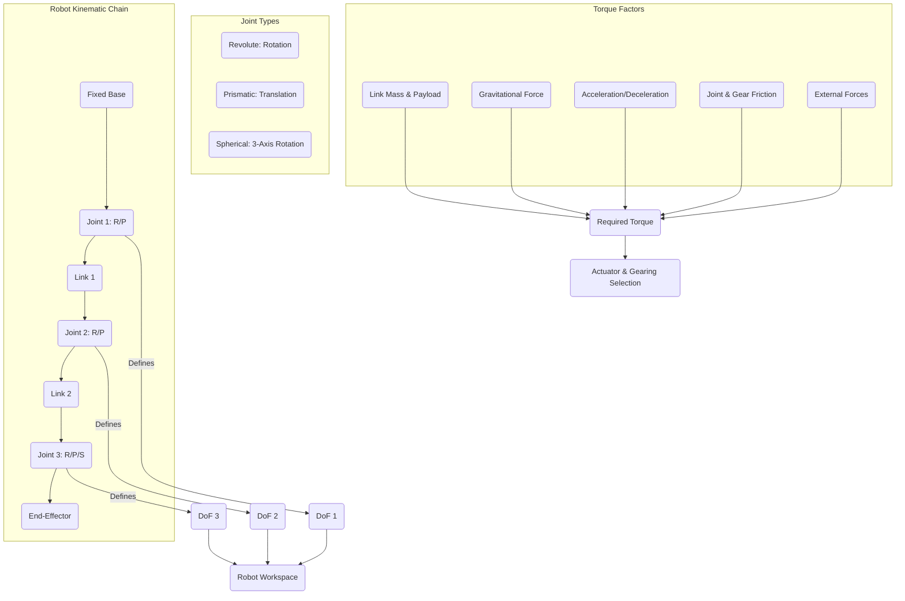
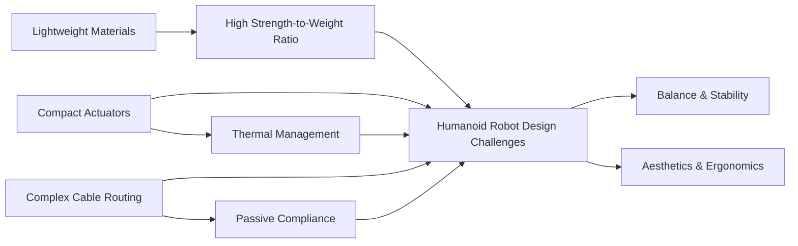

### Chapter 06: Mechanical Design & Joints

#### Learning Objectives
After studying this chapter, you should be able to:
*   Understand the fundamental principles and iterative process of mechanical design in robotics, from conceptualization to fabrication.
*   Classify and detail the characteristics of various robot joints (revolute, prismatic, spherical), including their impact on degrees of freedom and kinematic structure.
*   Perform comprehensive torque, force, and power calculations to select appropriate actuators and gearing for robot joints, considering static and dynamic loads.
*   Analyze and map a robot's workspace (reachable and dexterous) and articulate how joint limits, link lengths, and kinematic singularities affect it.
*   Identify and apply advanced mechanical design considerations specific to humanoid robots, such as lightweighting, compliance, thermal management, and human-centric ergonomics.

#### Theory Explanation

**6.1 Principles of Robotic Mechanical Design**

**Mechanical Design** forms the physical foundation of any robot, transforming abstract kinematic and dynamic models into tangible structures capable of executing tasks. It is an iterative process encompassing conceptualization, material selection, structural analysis, component sizing, and fabrication. Key principles include:

*   **Functionality**: The design must enable the robot to perform its intended tasks effectively and efficiently.
*   **Strength & Stiffness**: Components must withstand operational forces (payloads, acceleration, impacts) without permanent deformation or excessive deflection.
*   **Lightweighting**: Minimizing mass is crucial for dynamic performance, energy efficiency, and reducing motor requirements, especially for mobile and humanoid robots.
*   **Compactness**: Integrating motors, sensors, and wiring within limited space, particularly challenging in human-like form factors.
*   **Manufacturability**: Designs should be feasible and cost-effective to produce using available manufacturing techniques.
*   **Maintainability & Repairability**: Easy access to components for inspection, repair, or replacement.
*   **Safety**: Designing for intrinsic safety, preventing pinch points, sharp edges, and ensuring stable configurations.

**6.2 Robot Joints and Linkages: Building Blocks of Motion**

**Robot Joints** are mechanical connections between rigid bodies (links) that allow relative motion. They fundamentally define a robot's **degrees of freedom (DoF)** – the number of independent parameters required to uniquely specify the robot's configuration. For humanoid robots, the design of joints directly impacts dexterity, range of motion, and human-like movement.

**Common Joint Types:**

*   **Revolute (Rotational) Joint (R-joint)**:
    *   **Motion**: Allows relative rotation about a single axis.
    *   **DoF**: 1 (angular position, `θ`).
    *   **Applications**: Most common in robotic arms (shoulder, elbow, wrist, knee, hip joints in humanoids). Provides rotational motion.
*   **Prismatic (Translational) Joint (P-joint)**:
    *   **Motion**: Allows relative linear sliding along a single axis.
    *   **DoF**: 1 (linear displacement, `d`).
    *   **Applications**: Less common in humanoids but found in some industrial robots (e.g., linear actuators for telescoping arms). Provides linear motion.
*   **Spherical (Ball-and-Socket) Joint**:
    *   **Motion**: Provides three rotational degrees of freedom, allowing rotation about three orthogonal axes intersecting at a single point.
    *   **DoF**: 3 (e.g., Euler angles or quaternion for orientation).
    *   **Applications**: Mimics human shoulder, hip, or wrist joints. In practice, often implemented as a cluster of three revolute joints arranged to achieve the desired rotational freedom due to manufacturing complexity and control considerations of true ball joints.

**Linkages** are assemblies of rigid links connected by joints. The specific arrangement (kinematic chain) determines the robot's overall geometry, reach, and functional capabilities. Open kinematic chains are typical for manipulators, while closed kinematic chains appear in parallel robots or when a robot's end-effector is constrained.

**6.3 Actuator Selection and Torque Calculations**

Accurate **Torque Calculations** are vital for selecting appropriate actuators (motors, gearboxes) that can meet the robot's performance requirements (speed, acceleration, force). The torque (`τ`) required at each joint is influenced by:

*   **Gravity (`τ_g`)**: Torque needed to hold or move links/payloads against gravity. This is highly configuration-dependent.
*   **Inertial Forces (`τ_i`)**: Torques required to accelerate or decelerate links/payloads (related to mass, inertia, and angular acceleration).
*   **Coriolis and Centrifugal Forces (`τ_c`)**: Arise during multi-axis, dynamic movements (less dominant at low speeds).
*   **Friction (`τ_f`)**: Torques lost due to friction in bearings, gears, and within the joint itself.
*   **External Forces (`τ_ext`)**: Forces applied by the environment or manipulated objects (e.g., grasping force).

The total required torque at a joint is `τ_total = τ_g + τ_i + τ_c + τ_f + τ_ext`. Simplified calculations often focus on the worst-case static torque (against gravity with maximum payload) to ensure sufficient motor sizing.

For a single link of mass `m` and length `L`, with its center of mass `L_com` from the joint, and inclined at an angle `θ` from the vertical, the gravitational torque is `τ_g = m * g * L_com * sin(θ)`. Gearboxes are commonly used to increase output torque and reduce speed from a high-speed, low-torque motor, with a trade-off in efficiency and potential for backdrivability.

**6.4 Workspace Analysis**

**Workspace Analysis** maps the region of space that a robot's end-effector can reach. It is a critical design and planning tool to ensure the robot can physically accomplish its intended tasks. The workspace is influenced by link lengths, joint limits, and the robot's kinematic structure.

*   **Reachable Workspace**: The total volume that the robot's end-effector can physically touch, irrespective of its orientation. It is determined by the maximum and minimum extensions of the arm and the range of its joints.
*   **Dexterous Workspace**: A subset of the reachable workspace where the end-effector can achieve any desired orientation. This volume is generally smaller and more crucial for tasks requiring fine manipulation or arbitrary reorientation of tools.

Understanding singularities (Chapter 2) is also vital, as they represent points within or on the boundary of the workspace where the robot loses dexterity or its ability to move in certain directions.

**6.5 Mechanical Design Considerations for Humanoid Robots**

Designing humanoid robots presents unique and complex mechanical engineering challenges beyond those of typical industrial manipulators:

*   **Biomimicry & Aesthetics**: The need to resemble human form and movement, often involving complex joint structures and coverings that hide internal mechanisms without impeding function.
*   **Lightweight & High Strength-to-Weight Ratio**: Humanoids require dynamic movements, balance, and often the ability to carry objects. Using advanced lightweight materials (e.g., aluminum alloys, titanium, carbon fiber composites) and optimized structural designs is paramount to reduce inertia and power consumption.
*   **Compact & High Power-Density Actuators**: Motors and gearboxes must fit within human-sized limbs, often necessitating custom-designed, high-torque, and efficient actuators (e.g., specialized BLDCs with harmonic drives).
*   **Thermal Management**: Dense packing of powerful motors can lead to significant heat generation. Effective cooling systems (e.g., passive heat sinks, active fans, liquid cooling) are crucial to prevent overheating and ensure longevity.
*   **Cable Routing & Integration**: Managing hundreds of wires for power, sensors, and communication through narrow, articulating limbs requires meticulous design to prevent pinching, fatigue, and signal interference.
*   **Passive Compliance & Series Elastic Actuation (SEA)**: Integrating mechanical compliance (e.g., springs) within joints allows for shock absorption, safe interaction with the environment (including humans), and accurate force control. SEAs (Chapter 3) are a key example.
*   **Balance and Stability**: For bipedal locomotion, the mechanical design must support the complex control algorithms for maintaining balance (Center of Mass, Zero Moment Point - Chapter 4) and provide sufficient foot-ground contact. This includes robust foot design and sensor integration.
*   **Durability & Robustness**: Humanoids are subject to falls and impacts. Designs must incorporate features for impact absorption and ease of repair.
*   **Ergonomics & Safety**: Ensuring that the robot's design minimizes potential hazards during interaction and that its movements are intuitive and non-threatening to humans.

#### Diagrams


**Figure 6.1: Interplay of Mechanical Design Elements**


**Figure 6.2: Key Mechanical Design Considerations for Humanoid Robots**

#### Python/ROS2 Code Examples

##### 1. Python: Multi-Link Static Torque Calculation (Conceptual)
This example conceptually extends the static torque calculation for a multi-link arm, considering the cumulative effect of gravity on subsequent links. It simplifies by assuming links are uniform and points are in 2D.

```python
import math
import numpy as np

# Define a simple Link class for demonstration
class Link:
    def __init__(self, length, mass, center_of_mass_ratio=0.5): # COM at midpoint by default
        self.length = length
        self.mass = mass
        self.center_of_mass_from_joint = length * center_of_mass_ratio

def calculate_static_torques_2d_arm(links, joint_angles_rad, gravity=9.81):
    """
    Calculates the static torques required at each joint for a 2D planar arm
    against gravity. Assumes angles are measured from the horizontal.

    Args:
        links (list[Link]): List of Link objects, from base to end-effector.
        joint_angles_rad (list[float]): Angles of each joint (from horizontal) in radians.
        gravity (float): Acceleration due to gravity.

    Returns:
        list[float]: Torques at each joint in Nm.
    """
    num_joints = len(links)
    if num_joints != len(joint_angles_rad):
        raise ValueError("Number of links must match number of joint angles.")

    torques = [0.0] * num_joints

    # Iterate from the end-effector back to the base
    for i in range(num_joints - 1, -1, -1):
        current_link = links[i]
        current_joint_angle = joint_angles_rad[i]

        # Torque due to current link's mass
        # Assuming angle_rad is from horizontal, lever arm is L_com * cos(angle)
        torque_due_to_self = current_link.mass * gravity * current_link.center_of_mass_from_joint * math.cos(current_joint_angle)
        torques[i] += torque_due_to_self

        # Add torques from all subsequent links/payloads (recursive effect)
        if i < num_joints - 1:
            # The torque from link i+1 acts at the end of link i
            # So the lever arm for the NEXT joint's torque is the full length of current_link
            # This is a simplification; a full model would propagate forces and moments
            # For simplicity here, we're just adding the torque component due to next link's mass
            # acting at the end of the current link.
            # A more accurate way is to sum moments about each joint.

            # Simplified approach: each joint supports the weight of all links downstream
            # Let's recalculate based on center of mass of ALL links from current joint outwards

            # For a more rigorous approach, one would use Jacobian or recursive Newton-Euler
            # For this simplified example, let's just make it cumulative sum of masses
            cumulative_mass_below = sum(link.mass for link in links[i+1:]) # Mass of all subsequent links
            cumulative_torque_below = cumulative_mass_below * gravity * current_link.length * math.cos(current_joint_angle)
            torques[i] += cumulative_torque_below

    return torques

if __name__ == "__main__":
    # Example: A 3-link arm (like shoulder, elbow, wrist)
    link_data = [
        Link(length=0.5, mass=3.0), # Link 1 (e.g., upper arm)
        Link(length=0.4, mass=2.0), # Link 2 (e.g., forearm)
        Link(length=0.2, mass=1.0)  # Link 3 (e.g., hand/end-effector itself)
    ]

    # Joint angles from horizontal (e.g., all links horizontal)
    angles_horizontal = [math.pi / 2, math.pi / 2, math.pi / 2] # 90 degrees from vertical
    torques_h = calculate_static_torques_2d_arm(link_data, angles_horizontal)
    print(f"Torques (horizontal config): {np.array2string(np.array(torques_h), precision=2)} Nm")

    # Joint angles from horizontal (e.g., all links vertical down)
    angles_vertical_down = [0.0, 0.0, 0.0] # 0 degrees from horizontal
    torques_v = calculate_static_torques_2d_arm(link_data, angles_vertical_down)
    print(f"Torques (vertical down config): {np.array2string(np.array(torques_v), precision=2)} Nm")

    # Mixed angles (e.g., arm extended forward)
    angles_mixed = [math.pi / 4, math.pi / 6, math.pi / 12] # Some angles from horizontal
    torques_m = calculate_static_torques_2d_arm(link_data, angles_mixed)
    print(f"Torques (mixed config): {np.array2string(np.array(torques_m), precision=2)} Nm")
```

##### 2. ROS2: URDF for a Simple Humanoid Leg Segment
This example extends the URDF concept (from Chapter 2) to illustrate the definition of a more complex segment for a humanoid, specifically a thigh and shin connected by a knee joint. This showcases mechanical parameters, visual, collision, and inertial properties.

```xml
<!-- humanoid_leg.urdf.xacro -->
<robot name="humanoid_leg" xmlns:xacro="http://www.ros.org/wiki/xacro">

  <!-- Properties for thigh link -->
  <xacro:property name="thigh_length" value="0.4" />
  <xacro:property name="thigh_radius" value="0.06" />
  <xacro:property name="thigh_mass" value="3.0" />
  <xacro:property name="thigh_ixx" value="${thigh_mass * (3*thigh_radius*thigh_radius + thigh_length*thigh_length)/12}" />
  <xacro:property name="thigh_iyy" value="${thigh_mass * (3*thigh_radius*thigh_radius + thigh_length*thigh_length)/12}" />
  <xacro:property name="thigh_izz" value="${thigh_mass * thigh_radius*thigh_radius/2}" />

  <!-- Properties for shin link -->
  <xacro:property name="shin_length" value="0.45" />
  <xacro:property name="shin_radius" value="0.05" />
  <xacro:property name="shin_mass" value="2.5" />
  <xacro:property name="shin_ixx" value="${shin_mass * (3*shin_radius*shin_radius + shin_length*shin_length)/12}" />
  <xacro:property name="shin_iyy" value="${shin_mass * (3*shin_radius*shin_radius + shin_length*shin_length)/12}" />
  <xacro:property name="shin_izz" value="${shin_mass * shin_radius*shin_radius/2}" />

  <!-- Base link, typically connected to the torso/hip -->
  <link name="hip_pitch_link" />

  <!-- Thigh Link -->
  <link name="thigh_link">
    <visual>
      <geometry>
        <cylinder radius="${thigh_radius}" length="${thigh_length}"/>
      </geometry>
      <origin xyz="0 0 ${-thigh_length/2}" rpy="0 0 0"/>
      <material name="blue">
        <color rgba="0 0 0.8 1"/>
      </material>
    </visual>
    <collision>
      <geometry>
        <cylinder radius="${thigh_radius}" length="${thigh_length}"/>
      </geometry>
      <origin xyz="0 0 ${-thigh_length/2}" rpy="0 0 0"/>
    </collision>
    <inertial>
      <mass value="${thigh_mass}"/>
      <origin xyz="0 0 ${-thigh_length/2}"/>
      <inertia ixx="${thigh_ixx}" ixy="0" ixz="0" iyy="${thigh_iyy}" iyz="0" izz="${thigh_izz}"/>
    </inertial>
  </link>

  <!-- Knee Joint (Revolute) -->
  <joint name="knee_pitch_joint" type="revolute">
    <parent link="hip_pitch_link"/> <!-- Assuming hip_pitch_link is parent, adjust as needed -->
    <child link="thigh_link"/>
    <origin xyz="0 0 0" rpy="0 0 0"/> <!-- Origin of thigh_link relative to hip_pitch_link -->
    <axis xyz="0 1 0"/> <!-- Rotation around Y-axis (pitch) -->
    <limit lower="${-math.pi/2}" upper="${math.pi/2}" effort="100" velocity="10"/>
    <dynamics damping="0.01" friction="0.01"/>
  </joint>

  <!-- Shin Link (connected to thigh_link, for knee joint) -->
  <link name="shin_link">
    <visual>
      <geometry>
        <cylinder radius="${shin_radius}" length="${shin_length}"/>
      </geometry>
      <origin xyz="0 0 ${-shin_length/2}" rpy="0 0 0"/>
      <material name="green">
        <color rgba="0 0.8 0 1"/>
      </material>
    </visual>
    <collision>
      <geometry>
        <cylinder radius="${shin_radius}" length="${shin_length}"/>
      </geometry>
      <origin xyz="0 0 ${-shin_length/2}" rpy="0 0 0"/>
    </collision>
    <inertial>
      <mass value="${shin_mass}"/>
      <origin xyz="0 0 ${-shin_length/2}"/>
      <inertia ixx="${shin_ixx}" ixy="0" ixz="0" iyy="${shin_iyy}" iyz="0" izz="${shin_izz}"/>
    </inertial>
  </link>

  <!-- Ankle Joint (Revolute) -->
  <joint name="ankle_pitch_joint" type="revolute">
    <parent link="thigh_link"/>
    <child link="shin_link"/>
    <origin xyz="0 0 ${-thigh_length}" rpy="0 0 0"/> <!-- Shin attaches at bottom of thigh -->
    <axis xyz="0 1 0"/> <!-- Rotation around Y-axis (pitch) -->
    <limit lower="${-math.pi/2}" upper="${math.pi/2}" effort="100" velocity="10"/>
    <dynamics damping="0.01" friction="0.01"/>
  </joint>

</robot>
```
This XACRO (an extension of URDF) snippet defines a thigh and shin link, connected by a knee joint. It also calculates inertial properties using `xacro:property` for better readability and parameterization. This level of detail is crucial for realistic simulation and dynamic control.

#### Exercises + MCQs

##### Exercises
1.  **Humanoid Joint Design**: You are tasked with designing a new elbow joint for a humanoid robot. This joint needs to achieve a human-like range of motion (approx. 0 to 150 degrees of flexion) and must be able to lift a 2kg payload. Discuss the trade-offs in choosing between a single revolute joint (with a compact motor) and a four-bar linkage mechanism for this joint. Consider factors like workspace, torque requirements, backdrivability, and complexity.
2.  **Workspace Analysis**: For a 3-DOF robotic arm with two revolute joints for planar movement (like the examples in Chapter 2) and a third prismatic joint mounted at the end-effector for extension along its axis:
    a. Qualitatively describe its reachable and dexterous workspace.
    b. How would the introduction of joint limits (e.g., each revolute joint can only rotate 180 degrees) affect both workspaces?
3.  **Actuator Sizing & Gearing**: A robotic finger joint needs to generate a maximum torque of 0.5 Nm. You have a motor that produces 0.05 Nm at its optimal speed, but it can spin much faster than required. Calculate the minimum gear ratio needed. Discuss the implications of choosing a much higher gear ratio than the minimum (e.g., on speed, precision, and backdrivability).
4.  **URDF and Inertial Properties**: Explain the significance of the `<inertial>` tag in a URDF file. Why is it important to accurately define `mass`, `origin`, and `inertia` for each link, especially when working with dynamic control or simulation environments like Gazebo?

##### Multiple Choice Questions

:::info
Which of the following is NOT typically a primary goal in robotic mechanical design?
- [ ] Lightweighting
- [ ] Manufacturability
- [x] Aesthetic color scheme
- [ ] Strength and Stiffness
:::

:::info
A robot joint that allows relative linear sliding along a single axis is called a:
- [ ] Revolute joint
- [x] Prismatic joint
- [ ] Spherical joint
- [ ] Universal joint
:::

:::info
When performing static torque calculations for a robot joint, which factor is crucial to consider when the robot is holding a payload against gravity?
- [ ] The motor's maximum RPM
- [ ] The communication protocol of the joint controller
- [x] The mass of the links and payload, and their lever arm from the joint axis.
- [ ] The resolution of the joint encoder.
:::

:::info
The **Dexterous Workspace** of a robot refers to:
- [ ] The total volume the robot's end-effector can touch.
- [ ] The volume where the robot can move at maximum speed.
- [x] The volume within which the end-effector can achieve any desired orientation.
- [ ] The safe operating zone for human-robot interaction.
:::

:::info
For humanoid robots, integrating **passive compliance** in joint design primarily helps with:
- [ ] Increasing the robot's processing power.
- [ ] Simplifying the kinematic model.
- [x] Shock absorption, safe interaction, and improved force control.
- [ ] Reducing the number of required sensors.
:::
