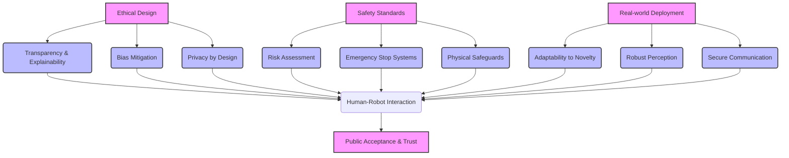

### Chapter 09: Ethics, Safety & Deployment

#### Learning Objectives
After studying this chapter, you should be able to:
*   Identify and analyze key ethical considerations in physical AI and humanoid robotics.
*   Understand fundamental robot safety standards and regulations.
*   Evaluate risks associated with human-robot interaction.
*   Describe the challenges and best practices for deploying robots in real-world environments.
*   Discuss principles of accountability and compliance in robotics development.

#### Theory Explanation

As physical AI and humanoid robots become more sophisticated and ubiquitous, addressing **Ethics, Safety, and Deployment** becomes paramount. These areas are not just regulatory hurdles but fundamental design considerations that impact public acceptance, legal liability, and the ultimate success of robotic systems.

**Ethical Considerations** in physical AI are complex and multifaceted:
*   **Autonomy and Control**: As robots gain more decision-making capabilities, who is ultimately responsible for their actions? What limits should be placed on robot autonomy?
*   **Impact on Employment**: The displacement of human labor by robots raises socio-economic concerns.
*   **Privacy**: Robots equipped with advanced sensors (cameras, microphones) collect vast amounts of data, raising privacy implications for individuals and environments.
*   **Bias and Discrimination**: If AI models used in robots are trained on biased data, they can perpetuate or amplify discrimination in physical interactions.
*   **Human Dignity and Dehumanization**: The design and behavior of humanoids can impact human perceptions and social structures.
*   **Transparency and Explainability**: Can we understand why a robot made a particular decision or performed a certain action?

**Robot Safety Standards and Regulations** are crucial for preventing harm to humans and property. Key standards organizations include ISO (International Organization for Standardization) and ANSI (American National Standards Institute). Examples include:
*   **ISO 10218**: Safety requirements for industrial robots.
*   **ISO/TS 15066**: Technical specification for collaborative robots (cobots), focusing on power and force limiting, speed and separation monitoring, and other human-robot collaboration safety features.
*   **Risk Assessment**: A systematic process to identify hazards, estimate risks, and implement risk reduction measures throughout the robot's lifecycle.

**Human-Robot Interaction (HRI) Ethics and Safety** focuses on safe and beneficial interactions. Considerations include:
*   **Physical Safety**: Preventing collisions, crushing, or other physical harm through safe motion planning, emergency stops, and compliant designs.
*   **Psychological Safety**: Ensuring robots do not cause distress, fear, or manipulation.
*   **Trust and Reliability**: Building systems that are dependable and whose behavior is predictable and understandable to humans.
*   **Social Norms**: Designing robots that respect cultural and social conventions.

**Real-World Deployment Challenges** are substantial:
*   **Uncertainty and Variability**: Real environments are far more complex and unpredictable than controlled lab settings or simulations.
*   **Perception Robustness**: Sensors can fail, encounter occlusions, or be fooled by novel situations.
*   **Adaptability**: Robots need to adapt to changing environments, tasks, and user needs over time.
*   **Maintenance and Longevity**: Robots are complex machines requiring regular maintenance, and their components have finite lifespans.
*   **Connectivity and Infrastructure**: Reliable communication (wireless, wired) and power infrastructure are often necessary.

**Compliance Guidelines** involve adhering to legal frameworks (e.g., GDPR for data privacy, product liability laws) and industry best practices. Establishing clear lines of **Accountability** for robot failures or unintended consequences is a significant legal and ethical challenge.

#### Diagrams


**Figure 9.1: Integrated Approach to Ethics, Safety, and Deployment in Robotics**

#### Python/ROS2 Code Examples

##### Python: Conceptual Emergency Stop (E-Stop) Logic
This Python script illustrates basic E-stop logic. In a real robot, this would directly interface with hardware and have much higher reliability requirements.

```python
import time
import threading

class RobotSystem:
    def __init__(self):
        self.motors_active = False
        self.e_stop_pressed = False
        self.current_speed = 0.0
        print("Robot system initialized.")

    def activate_motors(self):
        if not self.e_stop_pressed:
            self.motors_active = True
            self.current_speed = 0.5 # Start moving
            print("Motors activated. Robot moving.")
        else:
            print("Cannot activate motors: E-stop is pressed.")

    def deactivate_motors(self):
        self.motors_active = False
        self.current_speed = 0.0
        print("Motors deactivated. Robot stopped.")

    def press_e_stop(self):
        print("!!! EMERGENCY STOP PRESSED !!!")
        self.e_stop_pressed = True
        self.deactivate_motors()

    def release_e_stop(self):
        print("E-stop released.")
        self.e_stop_pressed = False

    def monitor_robot(self):
        while True:
            if self.motors_active and not self.e_stop_pressed:
                # Simulate continuous operation
                # In a real system, this would be monitoring sensors, etc.
                pass
            elif self.e_stop_pressed:
                # Ensure motors are off if E-stop is active
                if self.motors_active:
                    self.deactivate_motors()
            time.sleep(0.1)

# Simulate E-stop interaction in a separate thread
def simulate_e_stop_thread(robot_sys):
    time.sleep(2) # Robot runs for 2 seconds
    robot_sys.press_e_stop()
    time.sleep(3) # E-stop active for 3 seconds
    robot_sys.release_e_stop()
    time.sleep(1) # Robot could be reactivated
    robot_sys.activate_motors() # Try to reactivate after E-stop

if __name__ == "__main__":
    robot = RobotSystem()

    monitor_thread = threading.Thread(target=robot.monitor_robot, daemon=True)
    monitor_thread.start()

    e_stop_sim_thread = threading.Thread(target=simulate_e_stop_thread, args=(robot,))
    e_stop_sim_thread.start()

    robot.activate_motors()
    # Keep main thread alive to see daemon thread output
    time.sleep(10)
    robot.deactivate_motors()
    print("Simulation ended.")
```

##### ROS2: Conceptual Safety Node (Pseudocode)
In ROS2, safety-critical functions can be encapsulated in dedicated nodes, often integrated with safety controllers or hardware. This pseudocode shows a node that might monitor for safety violations and trigger an emergency stop.

```python
# safety_monitor_node.py

import rclpy
from rclpy.node import Node
from sensor_msgs.msg import Range # Example: Proximity sensor
from std_msgs.msg import Bool # To publish E-stop command

class SafetyMonitorNode(Node):
    def __init__(self):
        super().__init__('safety_monitor_node')
        self.declare_parameter('min_safe_distance', 0.2)
        self.min_safe_distance = self.get_parameter('min_safe_distance').get_parameter_value().double_value

        self.proximity_sub = self.create_subscription(
            Range, 'robot/proximity_sensor', self.proximity_callback, 10)
        self.e_stop_pub = self.create_publisher(
            Bool, 'robot/e_stop_command', 10)

        self.get_logger().info(f'SafetyMonitorNode started. Min safe distance: {self.min_safe_distance}m')

    def proximity_callback(self, msg):
        if msg.range < self.min_safe_distance:
            self.get_logger().error(f'!!! PROXIMITY VIOLATION: {msg.range:.2f}m < {self.min_safe_distance}m. Triggering E-stop!')
            e_stop_cmd = Bool()
            e_stop_cmd.data = True # Indicate E-stop should be active
            self.e_stop_pub.publish(e_stop_cmd)
        # In a real system, would also publish False when safe again, or have a latching E-stop

def main(args=None):
    rclpy.init(args=args)
    node = SafetyMonitorNode()
    rclpy.spin(node)
    node.destroy_node()
    rclpy.shutdown()

if __name__ == '__main__':
    main()
```

#### Exercises + MCQs

##### Exercises
1.  **Ethical Dilemma**: A caregiving humanoid robot is designed to assist elderly individuals. Discuss two potential ethical dilemmas that could arise (e.g., related to privacy, autonomy, or emotional manipulation) and propose how these might be mitigated through design or regulation.
2.  **Safety Standard Application**: You are designing a collaborative robot that works alongside humans on an assembly line. Identify three key safety features or design principles you would prioritize to ensure human safety, referencing relevant standards or concepts.
3.  **Deployment Plan**: Outline a high-level deployment plan for a mobile humanoid robot designed for retail environments. What are three major real-world challenges you anticipate, and how would you address them?

##### Multiple Choice Questions

:::info
Which ISO standard is specifically concerned with safety requirements for industrial robots?
- [ ] ISO 9001
- [ ] ISO 14001
- [x] ISO 10218
- [ ] ISO 27001
:::

:::info
The "Uncanny Valley" phenomenon in human-robot interaction primarily relates to:
- [ ] The robot's inability to perform physical tasks.
- [ ] The robot's high energy consumption.
- [x] The psychological discomfort humans feel towards robots that are almost, but not quite, human-like.
- [ ] The robot's communication protocols.
:::

:::info
When deploying a robot in a real-world, unstructured environment, a primary challenge related to perception is:
- [ ] Ensuring the robot has enough battery life.
- [ ] The static nature of sensor data.
- [x] The variability and unpredictability of sensor inputs due to noise, occlusions, and novel situations.
- [ ] The ease of calibrating sensors perfectly.
:::
