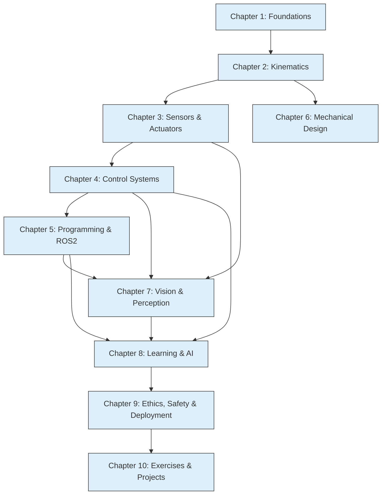

### Chapter 10: Exercises, Projects & Case Studies

#### Learning Objectives
After studying this chapter, you should be able to:
*   Apply knowledge from previous chapters to solve hands-on robotics problems.
*   Design and implement simple robot behaviors in simulation environments.
*   Analyze real-world humanoid robot projects and their underlying technologies.
*   Consolidate understanding through comprehensive review exercises and MCQs.
*   Identify potential future research directions and project opportunities in physical AI.

#### Theory Explanation (Summary of Key Concepts)

This chapter serves as a capstone, reinforcing the theoretical and practical knowledge gained throughout the textbook. We've explored the foundational aspects of **Physical AI**, distinguishing it from purely software-based systems and tracing its historical evolution. **Robot Kinematics** provided the mathematical tools to describe robot motion, with a deep dive into forward and inverse kinematics and the Denavit-Hartenberg convention. We then moved to **Sensors & Actuators**, understanding how robots perceive their environment and act upon it, emphasizing the crucial role of real-time feedback. **Control Systems** introduced the principles of feedback control, focusing on PID controllers and the distinction between kinematic and dynamic control approaches.

**Robot Programming in Python & ROS2** equipped you with the practical skills to develop modular robot software using the widely adopted ROS2 framework. **Mechanical Design & Joints** delved into the physical construction of robots, discussing joint types, torque calculations, workspace analysis, and unique considerations for humanoids. **Vision & Perception** covered how robots "see," from camera calibration and image processing to object detection and Simultaneous Localization and Mapping (SLAM). Finally, **Learning & AI in Robotics** explored advanced techniques like Reinforcement Learning and Imitation Learning, and the challenges of integrating AI models into physical systems. The critical importance of **Ethics, Safety & Deployment** was highlighted, addressing societal impact, safety standards, and real-world implementation hurdles.

This holistic understanding forms the basis for innovation in physical AI and humanoid robotics.

#### Diagrams


**Figure 10.1: Interconnectedness of Textbook Chapters**

#### Python/ROS2 Code Examples

Given this is a capstone chapter, the code examples here will be more project-oriented, demonstrating how different concepts can be combined.

##### Python/ROS2: Simple Mobile Robot with Obstacle Avoidance (Conceptual Integration)
This pseudocode illustrates how concepts from sensors, control, and ROS2 programming could integrate to create a basic obstacle-avoiding mobile robot.

```python
# integrated_mobile_robot_node.py (Conceptual ROS2 Node)

import rclpy
from rclpy.node import Node
from sensor_msgs.msg import LaserScan # From Chapter 3 (Sensors)
from geometry_msgs.msg import Twist    # To control robot velocity (Actuators)
from nav_msgs.msg import Odometry      # For robot localization (Feedback)
import numpy as np

class SimpleMobileRobotController(Node):
    def __init__(self):
        super().__init__('mobile_robot_controller')
        self.scan_sub = self.create_subscription(
            LaserScan, 'scan', self.scan_callback, 10)
        self.odom_sub = self.create_subscription(
            Odometry, 'odom', self.odom_callback, 10)
        self.cmd_vel_pub = self.create_publisher(
            Twist, 'cmd_vel', 10)

        self.current_linear_vel = 0.0
        self.current_angular_vel = 0.0
        self.closest_obstacle_distance = float('inf')

        self.control_timer = self.create_timer(0.05, self.control_loop) # 20 Hz control
        self.get_logger().info('Mobile Robot Controller Node started.')

    def scan_callback(self, msg: LaserScan):
        # Chapter 3: Sensor Processing - Find closest obstacle
        if msg.ranges:
            # Filter out inf values (no obstacle detected in that direction)
            finite_ranges = [r for r in msg.ranges if not np.isinf(r)]
            if finite_ranges:
                self.closest_obstacle_distance = min(finite_ranges)
            else:
                self.closest_obstacle_distance = float('inf')
        else:
            self.closest_obstacle_distance = float('inf')

    def odom_callback(self, msg: Odometry):
        # Chapter 4: Feedback Control - Update current velocity for internal state
        self.current_linear_vel = msg.twist.twist.linear.x
        self.current_angular_vel = msg.twist.twist.angular.z

    def control_loop(self):
        cmd_vel_msg = Twist()

        if self.closest_obstacle_distance < 0.5: # Obstacle very close
            # Chapter 4: Control Strategy - Stop and turn
            cmd_vel_msg.linear.x = 0.0
            cmd_vel_msg.angular.z = 0.5 # Turn right
            self.get_logger().warn(f'Obstacle detected at {self.closest_obstacle_distance:.2f}m! Stopping and turning.')
        elif self.closest_obstacle_distance < 1.5: # Obstacle somewhat close
            # Chapter 4: Control Strategy - Slow down and adjust course
            cmd_vel_msg.linear.x = 0.1
            cmd_vel_msg.angular.z = 0.2 # Slight turn
            self.get_logger().info(f'Obstacle at {self.closest_obstacle_distance:.2f}m. Slowing down.')
        else:
            # Chapter 4: Control Strategy - Move forward
            cmd_vel_msg.linear.x = 0.3
            cmd_vel_msg.angular.z = 0.0
            self.get_logger().info('Path clear. Moving forward.')

        self.cmd_vel_pub.publish(cmd_vel_msg)

def main(args=None):
    rclpy.init(args=args)
    node = SimpleMobileRobotController()
    rclpy.spin(node)
    node.destroy_node()
    rclpy.shutdown()

if __name__ == '__main__':
    main()
```

#### Exercises + MCQs

##### Hands-on Projects (Simulation Recommended)
1.  **"Follow the Wall" Robot**: Design and implement a ROS2 node (or Python script for a simulated robot) that enables a mobile robot to follow a wall at a constant distance using a LiDAR sensor. You will need to apply concepts from Chapter 3 (sensors), Chapter 4 (PID control for distance maintenance), and Chapter 5 (ROS2 programming).
2.  **Simple Manipulator Grasping**: Using a simulated robotic arm (e.g., in Gazebo with `moveit_ros`), implement a sequence to pick up a simple object. This will involve forward/inverse kinematics (Chapter 2), basic motion planning (Chapter 6 for mechanical limits), and joint control (Chapter 4, 5). You can use a visual sensor (Chapter 7) to detect the object.
3.  **Humanoid Balance Controller (Conceptual)**: For a bipedal humanoid model in a simulator, outline a conceptual control strategy (Chapter 4) for maintaining balance while walking. Consider the role of IMU data (Chapter 3) and possibly reinforcement learning (Chapter 8) for adaptation.

##### Case Studies
1.  **Boston Dynamics' Atlas**: Research Boston Dynamics' Atlas robot. Analyze how it demonstrates advanced capabilities in dynamic control, perception, and potentially learning. Discuss the mechanical design challenges for such a highly dynamic humanoid.
2.  **OpenAI's Dactyl**: Investigate OpenAI's Dactyl project, which learned dexterous in-hand manipulation using reinforcement learning in a simulated environment and then transferred to a real robot. Discuss the challenges of sim-to-real transfer highlighted by this project.

##### Review Exercises
1.  Briefly explain the role of homogeneous transformation matrices in robot kinematics.
2.  What is the main difference between proprioceptive and exteroceptive sensors? Give an example of each.
3.  How does the Integral term in a PID controller help eliminate steady-state error?
4.  Describe one advantage of using ROS2 for robot software development compared to a monolithic architecture.
5.  What are two significant ethical concerns that arise with the increasing autonomy of humanoid robots?

##### Multiple Choice Questions

:::info
The study of robot motion without considering forces is known as:
- [ ] Robot Dynamics
- [x] Robot Kinematics
- [ ] Control Theory
- [ ] Actuation Science
:::

:::info
Which sensor type would be most suitable for building a detailed 3D map of an unknown environment?
- [ ] Encoder
- [ ] Potentiometer
- [x] LiDAR
- [ ] Force/Torque sensor
:::

:::info
In ROS2, which communication mechanism is designed for synchronous, request-response interactions?
- [ ] Topics
- [x] Services
- [ ] Actions
- [ ] Parameters
:::

:::info
Reinforcement Learning in robotics learns policies by maximizing:
- [ ] The number of successful demonstrations.
- [x] Cumulative reward through trial and error interaction with the environment.
- [ ] The accuracy of inverse kinematic solutions.
- [ ] The speed of sensor data processing.
:::

:::info
One of the biggest challenges in deploying robots to real-world environments is:
- [ ] The static nature of the environment.
- [x] The inherent uncertainty, variability, and unpredictability of real-world conditions.
- [ ] The simplicity of integrating sensors.
- [ ] The availability of perfectly labeled datasets.
:::
